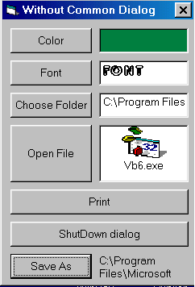



## Without Common Dialog Control

### Description

This code does every thing that the common dialog control can do. the module CDModule (CD = Common dialog) has function that replace the common dialog actions.

You need to have the common dialog dll.
 
### More Info
 

             |
---                |---
**Submitted On**   |2001-02-02 13:44:24
**By**             |[Perry](https://github.com/Planet-Source-Code/PSCIndex/blob/master/ByAuthor/perry.md)
**Level**          |Intermediate
**User Rating**    |5.0 (15 globes from 3 users)
**Compatibility**  |VB 5\.0, VB 6\.0
**Category**       |[Custom Controls/ Forms/  Menus](https://github.com/Planet-Source-Code/PSCIndex/blob/master/ByCategory/custom-controls-forms-menus__1-4.md)
**World**          |[Visual Basic](https://github.com/Planet-Source-Code/PSCIndex/blob/master/ByWorld/visual-basic.md)
**Archive File**   |[CODE\_UPLOAD14418222001\.zip](https://github.com/Planet-Source-Code/perry-without-common-dialog-control__1-14920/archive/master.zip)

